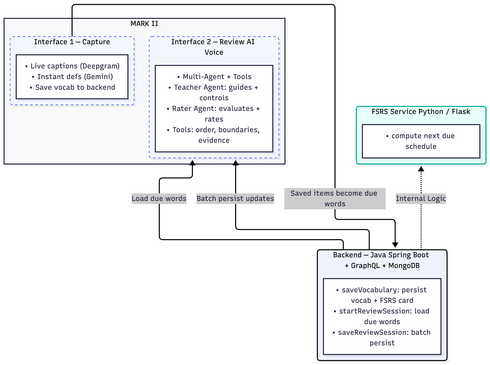
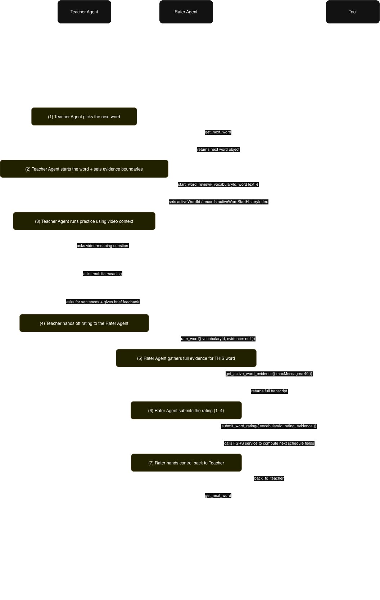

$${\color{orange}\Huge\text{No More Copy‑Pasting Captions 😓}}$$ 
$${\color{pink}\Huge\text{No More “What Does This Mean?” Tabs 🥲}}$$ 
$${\color{red}\Huge\text{No More Flashcard Hell 🤬}}$$
$${\color{green}\Huge\text{Just Learn—Right Where You Watch ✅}}$$
$${\color{blue}\Huge\text{🙀 🤯 Meet.....................}}$$

#  $${\color[RGB]{17,49,245}\Huge\text{MARK II}}$$
AI-powered Chrome extension that captures real-time 
  transcriptions from YouTube, provides instant 
  contextual definitions for any selected text, and reinforces
   learning through conversational AI Voice Agent.

## Changelog
### v2.0.2 (Current)
- Moved UI to a persistent **Chrome Side Panel** (no more popup auto-close)
- Connected **Interface 1 ↔ Interface 2** end-to-end via Spring Boot GraphQL + MongoDB:
  - Save vocabulary (`saveVocabulary`)
  - Load due words (`startReviewSession`)
  - Batch persist review results (`saveReviewSession`)
- Interface 2 upgraded to an **AI multi-agent voice review loop** (Teacher + Rater) with tool-based control:
  - Deterministic word order (`get_next_word`) to prevent session stalls
  - Word-boundary tracking + full word-level evidence for rating
  - Ratings buffered locally and **batch-synced on disconnect** (retry-safe)

### v2.0.0
- Extension UI was a **popup window** (closed on blur)
- Interface 1 and Interface 2 were **disconnected**
- Interface 2 was a **basic voice agent demo** (no tools, no multi-agent, no backend-driven review)

## Architecture Overview

### Multi-Agent Flow (Interface 2)

## Key Features

### Interface 1: Live Caption Viewer

#### 🎥 Demo (Click the thumbnail to watch)

- Live YouTube captions via real-time speech-to-text **[Deepgram](https://deepgram.com/product/speech-to-text)** in a persistent side panel (Spotify/other sites coming soon)
- One-click media controls: Rewind 15s / Play–Pause / Forward 15s
- Highlight any word / phrase / sentence to get instant, context-aware definitions + Chinese translation **[Gemini2.5 Flash Lite](https://ai.google.dev/gemini-api/docs/models)**
- Save selected items to your vocabulary set for later review in Interface 2

### Interface 2: AI Conversation Review
#### 🎥 Demo (Click the thumbnail to watch)

- Speak with an **AI multi-agent voice tutor** [OpenAI Realtime](https://github.com/openai/openai-realtime-agents) in the side panel
- **Teacher Agent** guides the conversation and keeps the session on track
- **Rater Agent** evaluates your responses using the full word-level transcript and assigns an FSRS rating
- Review results are buffered locally and batch-synced to the backend (GraphQL) on disconnect
## Resources
cross-site audio capture: https://developer.chrome.com/docs/web-platform/screen-sharing-controls/#displaySurface

cross-site audio control: https://developer.mozilla.org/en-US/docs/Web/API/Media_Session_API

Speech to Text API: https://developers.deepgram.com/docs/live-streaming-audio 

openAI-realtime-agnet: https://github.com/openai/openai-realtime-agents

## Roadmap

- Unsaved / Delete vocabulary entries
- Improve caption UX: longer transcript buffer for reliable selection
- Definition UX: bold/highlight the selected text inside definitions + examples
- Audio-clip context review in Interface 2 (review using the original moment from the video)

## $${\color{green}\Huge\text{Done}}$$

- Side Panel UI: Persistent extension UI that doesn’t close when you click the page
- Extension Messaging: Content script ↔ service worker ↔ side panel wired
- Backend (Java Spring Boot + GraphQL + MongoDB)
    - Save vocabulary: GraphQL saveVocabulary
    - Review sessions: GraphQL startReviewSession (load due) + saveReviewSession (batch persist)
- Interface 1 (Capture)
    - Real-time captions via Deepgram
    - Media controls (±15s, play/pause)
    - Instant definitions via Gemini 2.5 Flash Lite + Chinese translation
    - Deepgram keep-alive to prevent idle disconnect
- Interface 2 (Multi-Agent Voice Review)
    - Teacher + Rater multi-agent flow (OpenAI Realtime)
    - Loads due words from Spring Boot backend (GraphQL)
    - FSRS scheduling updates computed via FSRS service
    - Updates buffered locally and batch-synced to backend on disconnect

