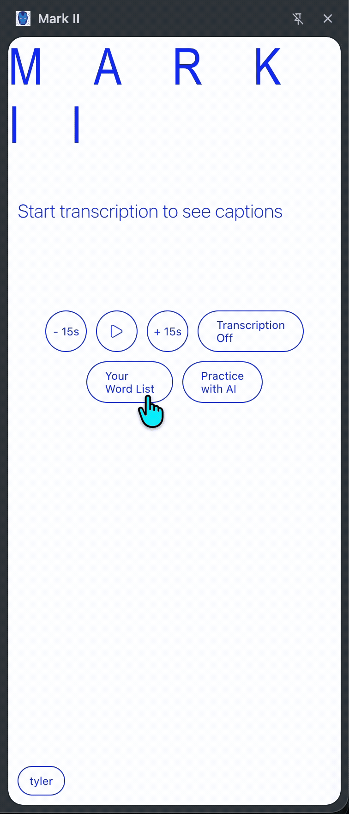

  <a href="./README.md">中文</a> | <a href="./README.en.md">English</a>

$${\color{orange}\Huge\text{不再复制字幕去查意思 😓}}$$
$${\color{pink}\Huge\text{不再跳转多个搜索标签页 🥲}}$$
$${\color{red}\Huge\text{不再掉进传统单词卡片地狱 🤬}}$$
$${\color{green}\Huge\text{学习一站式搞定，就在你观看的地方 ✅}}$$
$${\color{blue}\Huge\text{🙀 🤯 有请..............}}$$

#  $${\color[RGB]{17,49,245}\Huge\text{MARK II}}$$

MARK II 是一个 AI 驱动的 Chrome 插件。它围绕真实视频学习场景设计，能够在你观看 YouTube 时实时转录字幕、对任意选中文本做语境化释义，并通过 AI 语音导师把“看见”变成“会用”。

## 更新日志

### v3.11.0（当前）
- 新增账号体系与设置面板，支持登录/注册、兴趣展示、Agent 行为强度与语音风格个性化配置
  

    
  

- Interface 2 升级为可保存、恢复和管理的 voice session，支持会话列表、快照恢复、全局复习进度续接与自动标题
- 词库管理增强：支持查看词表、删除词条、调整 due date，并为词条保存 source video URL
  

    
  

- memory 系统重构为更完整的提取与 consolidate 流程，支持更稳定的长期个性化信息更新
- 工程化补齐：增加分发/隐私文档、打包产物与部署相关配置

### v2.2.0
- 用 [GPT-5.2](https://platform.openai.com/docs/models/gpt-5.2) 驱动的场景化 role-play 复习，取代枯燥的逐词问答流程
- 将后台评分模型升级为 [GPT-5-mini](https://platform.openai.com/docs/models/gpt-5-mini)，评分不再打断主对话
- 接入 [LangChain](https://docs.langchain.com/oss/python/concepts/memory#long-term-memory) + [MongoDB Atlas Vector Search](https://www.mongodb.com/docs/atlas/atlas-vector-search/tutorials/vector-search-quick-start/?deployment-type=atlas&interface-atlas-only=driver&language-atlas-only=nodejs) + [OpenAI Embeddings](https://platform.openai.com/docs/guides/embeddings#page-top) 构建长期记忆层，支持个性化提示与兴趣注入

### v2.1.0
- 实现确定性的多智能体复习流程（Teacher Agent + Rater Agent，严格工具调用与状态控制）
- Rater Agent 支持输出评分理由，结果可追溯

  

### v2.0.3
- 重构 Agent 日志 breadcrumb UI，展示更清晰
- 字幕转录启动更快、更稳定

  
  →
  

### v2.0.2
- UI 迁移到持久化 Chrome Side Panel，不再因失焦关闭
- 通过 Spring Boot GraphQL + MongoDB 打通 Interface 1 与 Interface 2：
  - 保存词汇 `saveVocabulary`
  - 加载到期词 `startReviewSession`
  - 批量持久化复习结果 `saveReviewSession`
- Interface 2 升级为 AI 多智能体语音复习闭环：
  - 确定性顺序控制，防止会话卡住
  - 词级边界追踪与证据聚合
  - 评分本地缓存，断开时批量同步

### v2.0.0
- 插件 UI 还是 popup，失焦即关闭
- Interface 1 与 Interface 2 尚未打通
- Interface 2 只是基础语音 Agent Demo，无工具、无多智能体、无后端驱动复习

## 架构概览

### 多智能体工作流（Interface 2）

待更新
<!--  -->

## 核心功能

### Interface 1：实时字幕 + 划词释义

#### 🎥 演示（点击缩略图观看）

- 基于 [Deepgram](https://deepgram.com/product/speech-to-text) 的实时语音转录，在持久化侧边栏里展示 YouTube 实时字幕
- 一键媒体控制：后退 15 秒 / 播放暂停 / 前进 15 秒
- 基于 [Gemini 2.5 Flash Lite](https://ai.google.dev/gemini-api/docs/models) 的语境化释义与中文翻译
  - 在当前场景下，该模型延迟很低，响应速度明显快于更重的模型，适合“划词即解释”这种低延迟中小任务
- 保存单词、短语或句子，进入后续复习链路

### Interface 2：AI 语音复习

#### 🎥 演示（点击缩略图观看）

- 基于 [OpenAI Realtime](https://github.com/openai/openai-realtime-agents) 的低延迟 AI 多智能体语音导师
  - Teacher Agent：负责主对话推进与教学反馈
  - Scene Planner（[GPT-5.2](https://platform.openai.com/docs/models/gpt-5.2)）：结合到期词、视频上下文、用户兴趣生成 role-play 场景
  - Background Rater（[GPT-5-mini](https://platform.openai.com/docs/models/gpt-5-mini)）：后台评分，不阻塞会话
- 基于 [FSRS](https://github.com/open-spaced-repetition/py-fsrs) 的复习调度更新，先本地缓冲，断开后批量同步 GraphQL
- 记忆层：LangChain + MongoDB Atlas Vector Search + OpenAI Embeddings，用于长期兴趣、偏好和对话线索的提取与召回

## 资源链接

- 跨站音频采集：[Chrome 官方文档](https://developer.chrome.com/docs/web-platform/screen-sharing-controls/#displaySurface)
- 跨站媒体控制：[MDN Media Session API](https://developer.mozilla.org/en-US/docs/Web/API/Media_Session_API)
- 实时语音转写：[Deepgram Live Streaming Audio](https://developers.deepgram.com/docs/live-streaming-audio)
- Realtime Agent 参考：[openai/openai-realtime-agents](https://github.com/openai/openai-realtime-agents)

## 分发与隐私

- Chrome 插件官方分发指南：[Distribute your extension](https://developer.chrome.com/docs/extensions/how-to/distribute)
- MARK II 分发清单：[docs/chrome-distribution.md](./docs/chrome-distribution.md)
- MARK II 隐私政策：[docs/privacy-policy.md](./docs/privacy-policy.md)

## 路线图

- 用 [LangGraph](https://docs.langchain.com/oss/python/langgraph/overview?_gl=1*1meb2nf*_gcl_au*MTE2NzMwMzQ1OC4xNzY4NDQ4MTUz*_ga*MTIyMTAwNzczLjE3Njg0NDgxNTM.*_ga_47WX3HKKY2*czE3Njg4MTE5OTEkbzYkZzEkdDE3Njg4MTIwMDEkajUwJGwwJGgw) 升级现有 Agent 工作流，提升稳定性与可控性
- 做页面内可随时调出的叠加式词汇面板
- 支持取消保存与删除词汇条目
- 优化字幕体验，延长可选择的转写缓冲

## $${\color{green}\Huge\text{已完成}}$$

- 持久化 Side Panel UI 与扩展消息通信
- 后端（Spring Boot + GraphQL + MongoDB）+ Python FSRS（Flask）联通
- Interface 1：Deepgram 字幕、媒体控制、Gemini 释义与中文翻译
- Interface 2：场景化 role-play、后台评分、FSRS 批量更新、断开批量同步
- 记忆层：基于向量检索的个性化提示与兴趣召回
