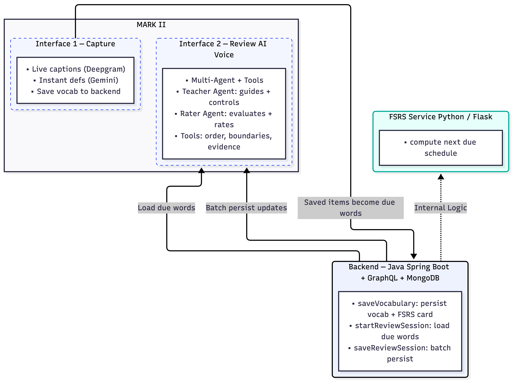

  <a href="./README.md">English</a> | <a href="./README.zh-CN.md">中文</a>

$${\color{orange}\Huge\text{不再复制字幕去查意思 😓}}$$
$${\color{pink}\Huge\text{不再跳转多个搜索标签页 🥲}}$$
$${\color{red}\Huge\text{不再掉进传统单词卡片地狱 🤬}}$$
$${\color{green}\Huge\text{学习一站式搞定，就在你观看的地方 ✅}}$$
$${\color{blue}\Huge\text{🙀 🤯 有请..............}}$$

#  $${\color[RGB]{17,49,245}\Huge\text{MARK II}}$$
AI 驱动的基于React的 Chrome 插件，可从 YouTube 捕获实时转录，为任意选中文本即时提供语境化释义，并通过 AI 语音对话强化学习效果。

## 更新日志
### v3.11.0 — J.A.R.V.I.S.（当前）
- 新增账号体系与设置面板，支持登录/注册、兴趣展示、Agent 行为强度与语音风格个性化配置
  

    
  

- Interface 2 升级为可保存、恢复和管理的 voice session，支持会话列表、快照恢复、全局复习进度续接与自动标题
- 词库管理增强：支持查看词表、删除词条、调整 due date，并为词条保存 source video URL
  

    
  

- memory 系统重构为更完整的提取与 consolidate 流程，支持更稳定的长期个性化信息更新
- 工程化补齐：增加分发/隐私文档、打包产物与部署相关配置

### v2.2.0
- 用 [GPT‑5.2](https://platform.openai.com/docs/models/gpt-5.2) 场景化 $${\color{orange}\text{role-play}}$$ 取代枯燥的逐词问答, 被 **Teacher Agent** 用来引导用户对话
- 更新 **Rater Agent** 的基础模型为 [GPT‑5‑mini](https://platform.openai.com/docs/models/gpt-5-mini)，并且现在不打断对话流程
- 接入 [LangChain](https://docs.langchain.com/oss/python/concepts/memory#long-term-memory) + [MongoDB 向量记忆](https://www.mongodb.com/docs/atlas/atlas-vector-search/tutorials/vector-search-quick-start/?deployment-type=atlas&interface-atlas-only=driver&language-atlas-only=nodejs)，做个性化提示

### v2.1.0
- **确定性**的多智能体复习流程（***Teacher Agent*** + ***Rater Agent***，严格工具调用 + 状态管理）
- ***Rater Agent*** 输出评分理由（可追溯）

  

### v2.0.3
  - 更清爽的Agent日志 UI（旧 → 新）。
    

      
      →
      
    

  - 字幕转录启动更快、更稳定。

### v2.0.2 
- UI 迁移到持久化 **Chrome 侧边栏**（不再因失焦关闭）
- 通过 Spring Boot GraphQL + MongoDB 打通 **Interface 1 ↔ Interface 2**：
  - 保存词汇（`saveVocabulary`）
  - 加载到期词（`startReviewSession`）
  - 批量持久化复习结果（`saveReviewSession`）
- Interface 2 升级为 **AI 多智能体语音复习闭环**（Teacher + Rater），并以工具驱动：
  - 确定性顺序（`get_next_word`），防止会话卡住
  - 词级边界追踪 + 完整证据用于评分
  - 评分本地缓存，断开时 **批量同步**（可重试）

### v2.0.0
- 插件 UI 为 **弹窗**（失焦即关闭）
- Interface 1 与 Interface 2 **未打通**
- Interface 2 仅为 **基础语音 Agent Demo**（无工具、无多智能体、无后端驱动复习）

## 架构概览
即将更新
<!--  -->

### 多智能体工作流（Interface 2）
即将更新
<!--  -->

## 主要功能

### Interface 1：实时字幕视图

#### 🎥 演示（点击缩略图观看）

- 通过基于 **[Deepgram](https://deepgram.com/product/speech-to-text)** 的实时语音转录，在侧边栏展示 YouTube 实时字幕
- 一键媒体控制：后退 15s / 播放–暂停 / 前进 15s
- 基于 **[Gemini2.5 Flash Lite](https://ai.google.dev/gemini-api/docs/models)** 的选中任意单词/短语/句子，获取即时、语境化释义 + 中文翻译功能。
  - 实测该模型延迟极低，响应速度明显快于 OpenAI 的 mini/nano 模型，通常快数秒；同时生成质量不差，非常适合定义清晰、低延迟的中小型任务。。
- 保存选中内容，供 Interface 2 复习

### Interface 2：AI 对话复习
#### 🎥 演示（点击缩略图观看）

- 基于React Chrome插件的 **AI 多智能体语音导师** **[OpenAI Realtime](https://github.com/openai/openai-realtime-agents)** 
  - **Teacher Agent** 负责对话与流程控制
  - **场景规划 Planner ([GPT‑5.2](https://platform.openai.com/docs/models/gpt-5.2))**：基于到期词 + 视频上下文生成 Role‑Play
  - **后台 Rater ([GPT‑5‑mini](https://platform.openai.com/docs/models/gpt-5-mini))** 批量评分，不打断对话
- **[FSRS](https://github.com/open-spaced-repetition/py-fsrs)**（用来计算下一个复习日） 评分先本地缓冲，断开时批量同步 GraphQL
- 记忆层：**[LangChain](https://docs.langchain.com/oss/python/concepts/memory#long-term-memory) + [MongoDB Atlas Vector Search](https://www.mongodb.com/docs/atlas/atlas-vector-search/tutorials/vector-search-quick-start/?deployment-type=atlas&interface-atlas-only=driver&language-atlas-only=nodejs) + [OpenAI Embeddings](https://platform.openai.com/docs/guides/embeddings#page-top)**
## 资源
cross-site audio capture: https://developer.chrome.com/docs/web-platform/screen-sharing-controls/#displaySurface

cross-site audio control: https://developer.mozilla.org/en-US/docs/Web/API/Media_Session_API

Speech to Text API: https://developers.deepgram.com/docs/live-streaming-audio 

openAI-realtime-agnet: https://github.com/openai/openai-realtime-agents

## 路线图

- 利用 [LangGraph](https://docs.langchain.com/oss/python/langgraph/overview?_gl=1*1meb2nf*_gcl_au*MTE2NzMwMzQ1OC4xNzY4NDQ4MTUz*_ga*MTIyMTAwNzczLjE3Njg0NDgxNTM.*_ga_47WX3HKKY2*czE3Njg4MTE5OTEkbzYkZzEkdDE3Njg4MTIwMDEkajUwJGwwJGgw) 升级现有 Agent 工作流，提升稳定性与可控性
- 叠加式词汇面板（页面内随时可用）
- 取消保存/删除词汇条目
- 改善字幕体验：更长的转写缓冲，便于稳定选择

## $${\color{green}\Huge\text{已完成}}$$

- 持久化侧边栏 UI + 扩展消息通信
- 后端（Spring Boot + GraphQL + MongoDB）+ Python FSRS（Flask）：saveVocabulary、startReviewSession、saveReviewSession、下次复习时间计算
- Interface 1（捕获）：Deepgram 字幕、媒体控制、Gemini 释义 + 中文翻译
- Interface 2（语音复习）：场景化 Role‑Play + 后台评分、FSRS 批量更新、断开批量同步
- 记忆层：LangChain + MongoDB 向量检索（个性化提示）
